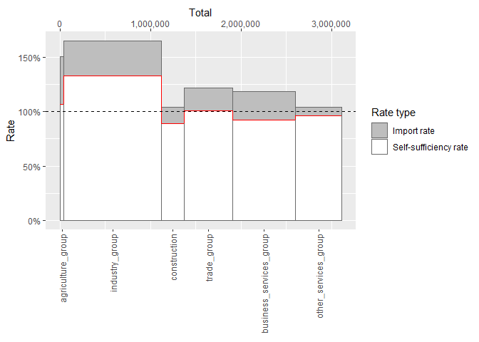

<!-- README.md is generated from README.Rmd. Please edit that file -->

# econio

<!-- badges: start -->

[](https://github.com/UchidaMizuki/econio/actions/workflows/R-CMD-check.yaml)
[](https://app.codecov.io/gh/UchidaMizuki/econio)
<!-- badges: end -->

econio provides a set of functions for input-output analysis.

## Installation

You can install the development version of econio from
[GitHub](https://github.com/) with:

``` r
# install.packages("pak")
pak::pak("UchidaMizuki/econio")
```

## Example

``` r
library(econio)

library(tidyverse)
library(iotables)
```

### Create an input-output table object

First, You need to prepare an input-output table in a tidy format. Then,
you can create an input-output table object by using
`io_table_regional()` function.

``` r
table_germany_1995 <- iotable_get(source = "germany_1995") |> 
  rename(input_sector_name = iotables_row) |>
  pivot_longer(!input_sector_name,
               names_to = "output_sector_name",
               values_to = "value") |>
  mutate(input_sector_type = case_match(input_sector_name,
                                        "total" ~ "industry",
                                        "imports" ~ "import",
                                        "net_tax_products" ~ "value_added"),
         output_sector_type = case_match(output_sector_name,
                                         "total" ~ "industry",
                                         "gross_capital_formation" ~ "final_demand",
                                         "exports" ~ "export")) |>
  relocate(input_sector_type, input_sector_name, output_sector_type, output_sector_name) |>
  fill(input_sector_type, output_sector_type,
       .direction = "up") |>
  drop_na(input_sector_type, output_sector_type) |>
  filter(!input_sector_name %in% c("total", "intermediate_consumption", "gva", "output"),
         !output_sector_name %in% c("total", "total_final_use"))
table_germany_1995
#> # A tibble: 132 × 5
#>    input_sector_type input_sector_name output_sector_type output_sector_name    
#>    <chr>             <fct>             <chr>              <chr>                 
#>  1 industry          agriculture_group industry           agriculture_group     
#>  2 industry          agriculture_group industry           industry_group        
#>  3 industry          agriculture_group industry           construction          
#>  4 industry          agriculture_group industry           trade_group           
#>  5 industry          agriculture_group industry           business_services_gro…
#>  6 industry          agriculture_group industry           other_services_group  
#>  7 industry          agriculture_group final_demand       final_consumption_hou…
#>  8 industry          agriculture_group final_demand       final_consumption_gov…
#>  9 industry          agriculture_group final_demand       inventory_change      
#> 10 industry          agriculture_group final_demand       gross_capital_formati…
#> # ℹ 122 more rows
#> # ℹ 1 more variable: value <int>

# You can suppress the message by setting `competitive_import = FALSE`
iotable_germany_1995 <- io_table_regional(table_germany_1995)
#> Assuming `competitive_import = FALSE`.
iotable_germany_1995
#> # Input-output table: regional
#> # Dimensions:         input [12], output [11]
#> # Input:              12 sectors
#> # Output:             11 sectors
#> # Import type:        noncompetitive
#>    input$sector                 output$sector                              
#>    <sector>                     <sector>                                   
#>  1 <industry> agriculture_group <industry> agriculture_group               
#>  2 <industry> agriculture_group <industry> industry_group                  
#>  3 <industry> agriculture_group <industry> construction                    
#>  4 <industry> agriculture_group <industry> trade_group                     
#>  5 <industry> agriculture_group <industry> business_services_group         
#>  6 <industry> agriculture_group <industry> other_services_group            
#>  7 <industry> agriculture_group <final_demand> final_consumption_households
#>  8 <industry> agriculture_group <final_demand> final_consumption_government
#>  9 <industry> agriculture_group <final_demand> inventory_change            
#> 10 <industry> agriculture_group <final_demand> gross_capital_formation     
#> # ℹ 122 more rows
#> # ℹ 1 more variable: . <dbl>
```

### Calculate input coefficients and Leontief inverse matrix

``` r
io_input_coef(iotable_germany_1995)
#> # Input-output table: regional
#> # Dimensions:         input [6], output [6]
#> # Input:              6 sectors
#> # Output:             6 sectors
#> # Import type:        noncompetitive
#>    input$sector                 output$sector                               .
#>    <sector>                     <sector>                                <dbl>
#>  1 <industry> agriculture_group <industry> agriculture_group       0.0258    
#>  2 <industry> agriculture_group <industry> industry_group          0.0236    
#>  3 <industry> agriculture_group <industry> construction            0.00000407
#>  4 <industry> agriculture_group <industry> trade_group             0.00112   
#>  5 <industry> agriculture_group <industry> business_services_group 0.00103   
#>  6 <industry> agriculture_group <industry> other_services_group    0.00150   
#>  7 <industry> industry_group    <industry> agriculture_group       0.181     
#>  8 <industry> industry_group    <industry> industry_group          0.282     
#>  9 <industry> industry_group    <industry> construction            0.261     
#> 10 <industry> industry_group    <industry> trade_group             0.0761    
#> # ℹ 26 more rows
io_leontief_inverse(iotable_germany_1995)
#> # Input-output table: regional
#> # Dimensions:         output [6], input [6]
#> # Input:              6 sectors
#> # Output:             6 sectors
#> # Import type:        noncompetitive
#>    output$sector                input$sector                             .
#>    <sector>                     <sector>                             <dbl>
#>  1 <industry> agriculture_group <industry> agriculture_group       1.03   
#>  2 <industry> agriculture_group <industry> industry_group          0.0350 
#>  3 <industry> agriculture_group <industry> construction            0.0100 
#>  4 <industry> agriculture_group <industry> trade_group             0.00509
#>  5 <industry> agriculture_group <industry> business_services_group 0.00303
#>  6 <industry> agriculture_group <industry> other_services_group    0.00442
#>  7 <industry> industry_group    <industry> agriculture_group       0.290  
#>  8 <industry> industry_group    <industry> industry_group          1.43   
#>  9 <industry> industry_group    <industry> construction            0.396  
#> 10 <industry> industry_group    <industry> trade_group             0.142  
#> # ℹ 26 more rows
```

### Draw a skyline chart

``` r
iotable_germany_1995 |> 
  io_table_to_competitive_import() |> 
  autoplot(type = "skyline")
```


