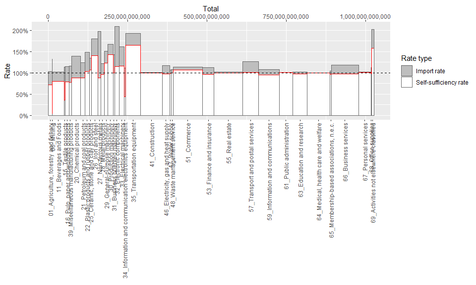

<!-- README.md is generated from README.qmd. Please edit that file -->

# econio

<!-- badges: start -->

[](https://github.com/UchidaMizuki/econio/actions/workflows/R-CMD-check.yaml)
[](https://app.codecov.io/gh/UchidaMizuki/econio)
<!-- badges: end -->

econio provides a set of functions for input-output analysis.

## Installation

You can install the development version of econio from
[GitHub](https://github.com/) with:

``` r
# install.packages("pak")
pak::pak("UchidaMizuki/econio")
```

## Example

``` r
library(econio)

library(econiodatajp)
library(ggplot2)
```

### Create an input-output table object

[econiodatajp](https://github.com/UchidaMizuki/econiodatajp) provides
Japan’s input-output tables as ready-to-use `econ_io_table` objects, so
you don’t need to build one from a tidy data frame yourself. Use
`io_table_get()` to fetch a specific table:

``` r
iotable <- io_table_get(
  region_type = "regional",
  region_class = "nation",
  year = 2020,
  sector_class = "large",
  language = "en"
)
#> trying URL 'https://www.e-stat.go.jp/stat-search/file-download?statInfId=000040187024&fileKind=0'
#> downloaded 734 KB
#> 
#> trying URL 'https://www.e-stat.go.jp/stat-search/file-download?statInfId=000040186856&fileKind=0'
#> downloaded 68 KB
#> 
#> trying URL 'https://www.e-stat.go.jp/en/stat-search/file-download?statInfId=000040186856&fileKind=0'
#> downloaded 59 KB
#> 
iotable
#> # Input-output table: regional
#> # Dimensions:         input [43], output [47]
#> # Input:              43 sectors
#> # Output:             47 sectors
#> # Import type:        competitive
#>    input$sector                                    output$sector                                               .
#>    <sector>                                        <sector>                                                <dbl>
#>  1 <industry> 01_Agriculture, forestry and fishery <industry> 01_Agriculture, forestry and fishery    1602100000
#>  2 <industry> 01_Agriculture, forestry and fishery <industry> 06_Mining                                        0
#>  3 <industry> 01_Agriculture, forestry and fishery <industry> 11_Beverages and Foods                  7253300000
#>  4 <industry> 01_Agriculture, forestry and fishery <industry> 15_Textile products                       16500000
#>  5 <industry> 01_Agriculture, forestry and fishery <industry> 16_Pulp, paper and wooden products       289700000
#>  6 <industry> 01_Agriculture, forestry and fishery <industry> 39_Miscellaneous manufacturing products   39900000
#>  7 <industry> 01_Agriculture, forestry and fishery <industry> 20_Chemical products                      41700000
#>  8 <industry> 01_Agriculture, forestry and fishery <industry> 21_Petroleum and coal products                   0
#>  9 <industry> 01_Agriculture, forestry and fishery <industry> 22_Plastic products and rubber products  103500000
#> 10 <industry> 01_Agriculture, forestry and fishery <industry> 25_Ceramic, stone and clay products         800000
#> # ℹ 2,011 more rows
```

### Calculate input coefficients and Leontief inverse matrix

``` r
io_input_coef(iotable)
#> Assuming `open_economy = FALSE`.
#> # Input-output table: regional
#> # Dimensions:         input [37], output [37]
#> # Input:              37 sectors
#> # Output:             37 sectors
#> # Import type:        competitive
#>    input$sector                                    output$sector                                             .
#>    <sector>                                        <sector>                                              <dbl>
#>  1 <industry> 01_Agriculture, forestry and fishery <industry> 01_Agriculture, forestry and fishery    0.130   
#>  2 <industry> 01_Agriculture, forestry and fishery <industry> 06_Mining                               0       
#>  3 <industry> 01_Agriculture, forestry and fishery <industry> 11_Beverages and Foods                  0.191   
#>  4 <industry> 01_Agriculture, forestry and fishery <industry> 15_Textile products                     0.00568 
#>  5 <industry> 01_Agriculture, forestry and fishery <industry> 16_Pulp, paper and wooden products      0.0253  
#>  6 <industry> 01_Agriculture, forestry and fishery <industry> 39_Miscellaneous manufacturing products 0.00455 
#>  7 <industry> 01_Agriculture, forestry and fishery <industry> 20_Chemical products                    0.00147 
#>  8 <industry> 01_Agriculture, forestry and fishery <industry> 21_Petroleum and coal products          0       
#>  9 <industry> 01_Agriculture, forestry and fishery <industry> 22_Plastic products and rubber products 0.00756 
#> 10 <industry> 01_Agriculture, forestry and fishery <industry> 25_Ceramic, stone and clay products     0.000122
#> # ℹ 1,359 more rows
io_leontief_inverse(iotable)
#> Assuming `open_economy = FALSE`.
#> # Input-output table: regional
#> # Dimensions:         output [37], input [37]
#> # Input:              37 sectors
#> # Output:             37 sectors
#> # Import type:        competitive
#>    output$sector                                   input$sector                                              .
#>    <sector>                                        <sector>                                              <dbl>
#>  1 <industry> 01_Agriculture, forestry and fishery <industry> 01_Agriculture, forestry and fishery    1.19    
#>  2 <industry> 01_Agriculture, forestry and fishery <industry> 06_Mining                               0.000704
#>  3 <industry> 01_Agriculture, forestry and fishery <industry> 11_Beverages and Foods                  0.286   
#>  4 <industry> 01_Agriculture, forestry and fishery <industry> 15_Textile products                     0.0116  
#>  5 <industry> 01_Agriculture, forestry and fishery <industry> 16_Pulp, paper and wooden products      0.0436  
#>  6 <industry> 01_Agriculture, forestry and fishery <industry> 39_Miscellaneous manufacturing products 0.0108  
#>  7 <industry> 01_Agriculture, forestry and fishery <industry> 20_Chemical products                    0.00860 
#>  8 <industry> 01_Agriculture, forestry and fishery <industry> 21_Petroleum and coal products          0.000467
#>  9 <industry> 01_Agriculture, forestry and fishery <industry> 22_Plastic products and rubber products 0.0136  
#> 10 <industry> 01_Agriculture, forestry and fishery <industry> 25_Ceramic, stone and clay products     0.00202 
#> # ℹ 1,359 more rows
```

### Draw a skyline chart

``` r
autoplot(iotable, type = "skyline")
```


